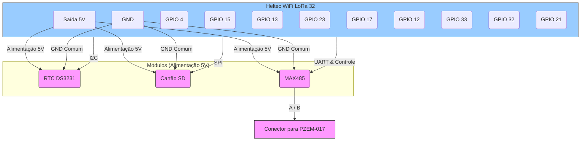

# Guia de Design da Placa Receptora para CNC (Versão 5V)

Este documento detalha os componentes e conexões para a sua montagem, que utiliza a linha de 5V para alimentar os módulos.

---

## 1. Lista de Materiais (Bill of Materials - BOM)

### Módulos Principais
| Qtd | Componente | Encapsulamento | Termos de Busca (KiCad/EasyEDA) |
|:---:|:---|:---|:---|
| 1 | Heltec WiFi LoRa 32 (V2) | Módulo (THT) | `Heltec WiFi LoRa 32 V2`, `ESP32 38 pin` |
| 1 | Módulo RTC DS3231 | Módulo (THT) | `DS3231 module`, `ZS-042` |
| 1 | Módulo Cartão MicroSD | Módulo (THT) | `MicroSD module SPI` |
| 1 | Módulo RS485 | Módulo (THT) | `MAX485 module` |

**AVISO IMPORTANTE:** Esta lista assume que os seus módulos RTC, MicroSD e RS485 são **totalmente compatíveis com alimentação de 5V** e possuem reguladores e conversores de nível lógico integrados para proteger as linhas de dados do ESP32.

### Componentes Passivos e de Suporte
| Qtd | Componente | Descrição / Código | Encapsulamento | Termos de Busca (KiCad/EasyEDA) |
|:---:|:---|:---|:---|:---|
| 3 | Capacitor Cerâmico **0.1uF (100nF)** | `104` | THT ou SMD | `100nF`, `C_Small` |

### Conectores
| Qtd | Componente | Uso | Encapsulamento | Termos de Busca (KiCad/EasyEDA) |
|:---:|:---|:---|:---|:---|
| 1 | Conector Borne (KF301) 2 Pinos | Conexão com o PZEM-017 | THT | `KF301-2P`, `Conn_01x02_Screw_Terminal`|
| ~ | Barras de Pinos (Pin Header) | Para soquetar os módulos | THT | `Header 2.54mm`, `Conn_01x*` |

---

## 2. Mapa de Conexões e Lógica do Circuito

### Lógica da Alimentação
1.  A placa Heltec LoRa é alimentada via USB.
2.  A saída de **5V** da placa Heltec é usada para alimentar todos os outros módulos (RTC, Cartão SD e MAX485).
3.  A saída de **3.3V** da placa Heltec **não é utilizada** para alimentar módulos externos nesta configuração.

### Conexões
- **Módulo RTC (DS3231)**
  - `RTC VCC` → `ESP32 5V`
  - `RTC GND` → `ESP32 GND`
  - `RTC SDA` → `ESP32 GPIO 4`
  - `RTC SCL` → `ESP32 GPIO 15`

- **Módulo Cartão SD**
  - `SD VCC` → `ESP32 5V`
  - `SD GND` → `ESP32 GND`
  - `SD MISO` → `ESP32 GPIO 13`
  - `SD MOSI` → `ESP32 GPIO 23`
  - `SD SCK` → `ESP32 GPIO 17`
  - `SD CS` → `ESP32 GPIO 12`

- **Módulo RS485 (MAX485)**
  - `MAX485 VCC` → `ESP32 5V`
  - `MAX485 GND` → `ESP32 GND`
  - `MAX485 DI` → `ESP32 GPIO 33 (TX2)`
  - `MAX485 RO` → `ESP32 GPIO 32 (RX2)`
  - `MAX485 DE/RE` → `ESP32 GPIO 21`
  - `MAX485 A/B` → Conector Borne para o PZEM-017

### Capacitores de Decoupling (Recomendado)
- Para estabilidade, coloque um capacitor de **0.1uF** o mais perto possível do pino `VCC` de cada módulo (RTC, SD, MAX485), conectando-os entre `5V` e `GND`.

---

## 3. Diagrama de Blocos (Configuração 5V)

